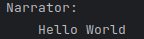
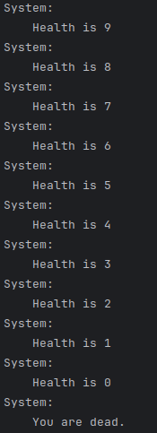

## RPGSCRIPT

## Functions
    TEXT = TEXT:<name>:<text>
    QUESTION = QUESTION:<name>:<var>:<var_type>:<text>:<option1>,<option2>,...
    IF = IF:<var>:<==|!=|>|<|>=|<=>:<text>:<CMD with ";">
    GOTO = GOTO:<line_num>
    VAR = VAR:<var_type>:<var>:<value>
    CLEAR = CLEAR:<var_name>
    RETURN = RETURN:<VARS|text>
## Math Functions:
    ADD = ADD:<item1>,<item2>,...:<output_var_name>
    SUB = SUB:<item1>,<item2>,...:<output_var_name>
    MUL = MUL:<item1>,<item2>,...:<output_var_name>
    DIV = DIV:<item1>,<item2>:<output_var_name>
    MOD = MOD:<item1>,<item2>:<output_var_name>
    //:<comment_text> = a comment (ignored by compiler)
 

    TODO: add POW: x to the power of y
    TODO: I will not be adding tetration
 

    $\<var_name> references a variable by that name

## TYPES:
    STRING = python string
    INT = python integer
    FLOAT = python float
    BOOL = python boolean

TODO: add LOAD: a function for loading external resources, namely jsons, XMLs and .dialogue files

## BACKEND:
    variables are stored in a list of dictionaries, specifying variable name, value and internal type.

## EXAMPLES:
    1. VAR:STRING:variable_1:Hello World
    2. TEXT:Narrator:$variable_1

  
    
    1. VAR:INT:p_health:10
    2. IF:p_health:<=:0:GOTO;6
    3. SUB:p_health,1:p_health
    4. TEXT:System:Health is $p_health
    5. GOTO:2
    6. RETURN:Dead

  

    
